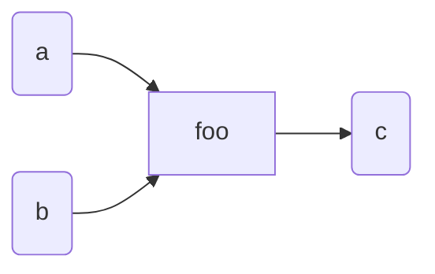

### This Library 
A library to design, execute and compile *Symbolic Neural Networks*

> **Disclaimer**
> this project started as a personal attempt to implement, efficiently, *the propagation model of computation*. This library stems from this personal challenge.

This library heavily draws on the Propagation Model of Computation https://dspace.mit.edu/bitstream/handle/1721.1/54635/603543210-MIT.pdf?sequence=2&isAllowed=y. 

More generally, this work is in between *game theory*, *automated reasoning* and *computer science*.

***But what is the Propagation Model of Computation?***

It's a model that applies the philophy of evolutionary and adaptive systems to your design, in such a way to make it *flexible* and *adaptive* as an *Organic Body*. 

***Can you be more precise?***

Sure, 
> The propagator model is built on the idea that the basic
computational elements are propagators, **autonomous independent**
machines interconnected by shared cells through which they
**communicate**. *Each propagator machine continuously examines the
cells it is connected to, and adds information to some cells based on
computations it can make from information it can get from others* [**activation rule**].
Cells accumulate information and propagators produce information.

The model describes a complex system whose evolution is entirely described by
- the activation rule. 
- the topology of the network.

***And what about neural network? then***

I asked an LLM to explain very birefly what a neural network is
>A neural network is a computational model inspired by the human brain, consisting of interconnected layers of nodes (neurons) that process input data to learn patterns and make predictions or decisions.

Hence, the propagation model is just a Neural Network that uses a behvioral activation rule. 

If we ask the LLM about the activation rule
> An activation rule determines the output of a neuron based on its input, typically using a function like ReLU, sigmoid, or tanh to introduce non-linearity.
Example of a sigmoid
>$$
\sigma(x) = \frac{1}{1 + e^{-x}}
$$
>

The *activation rule* proposed in the model looks like a **ReLU**, that is essentially a *step-function*

***I am confused, usually we train neural networks on some data, we have no data***

We do not need to train our propagation network on some data. The propagation network can be seen as a *Bayesian Network* in which all conditional marginal probabilities are either 1 or 0

***Is there some document that I can consult on the topic?*** 

As a reference, I suggest the UCLA automated reasoning playlist, in specific this lesson
https://www.youtube.com/watch?v=Sq4mOB6PiLk&t=2111s

***Are you saying that a propagation network is just a neural network? How does it work?***

Yes, and that's all. The model however works on the assumption that there is a way to *measure* information. That is why, most of the book, is concerned with the modeling of partial information structures. 

***Can you tell me a little bit more about information?***

Sure, think about information as a *boolean*. Either there is some information or there is no information at all. Then, you can merge information. The act of merging information cannot decrease the amount of knwoledged acquired. At most, it may result in a logical contradiction which, still is a very informative result. 

***Can you tell more more about game theory?*** 

Sure, I suggest this reading from the SEP: https://plato.stanford.edu/entries/common-knowledge/#2.3. The article is about **Common Knowledge** and it offers an essential overview of game theory. 


### Walk through 
> The library is a work in progress
>
> **Planned changes:**
>  - use `cljc` files. This removes dependencies from the host platform, the `JVM`
>  - Refactor the `neuron` protocol 
>    - create `IPlayer` protocol (the goal is a more sophisticated lang for describing rules and preferences)
> - Refactor the `contradiction` API

> **Planned improvements**
> 
> - POC of a small js front-end to render
>   - the symbolic neural network
>   - the boolean formula 
>   - the evaluation to inspect logical contradictions 
>   
> A front-end to see the graph is almost mandatory
> - use the js front end to deploy a simple SPA 
> 
> At the moment, the candidate engine for rendering the graph is https://github.com/kieler/elk-live. 
>
> - Language Syntax 
>   - in addition to LISP syntax, add math syntax for abstract circuits
>
> ```f(a, b) -> c ```
> 
> Finally, in a later stage, the algorithm calculating the `boolean function` shall be written in a different way.
> In particular, a marginal query function (easy to implement) shall be exposed and that can be used to improve the design and performance of the algorithms. 

#### Features 
The APIs of the library are *all* immutable. However, it is very easy to introduce mutability if you need to do that (eg, a reactive backend). There are two suggested way: 

- wrap a circuit into an atom
- implement your mutable partial information structures 

At the network level you do not need coordination, the network provides that for you.

##### Quick start 
There are just two main API you need to understand to getting started:
- `circuit`
- `neuron`

**How do I design a circuit, a symbolic neural network?**

To design a circuit you need to use the `circuit` API which requires a name for the circuit and a variadic number of `neuron`s. 

**`neuron`**
```clojure
(neuron 'neuron-name 'cell-i ... 'cell-n 'cell-output)
```
A neuron requires a name and a list of cells. Notice that everything is symbolic. By convention, the last cell is considered the output cell whereas the other cells are inputs cells.

**Example**
```clojure
;; name: foo
;; args: a, b
;; out:  c
(neuron 'foo a b c)
```

If you evaluate `(neuron 'foo a b c)` you obtain a function. This function will merge the neuron into a `circuit.` 
> For the moment the library does not support functions calculating multiple outputs. 

At this point we know how to instantiate a circuit

```clojure
(def foo-circuit
  (circuit
   'foo
   (neuron 'bar 'a 'b 'c)
   (neuron 'yin 'c 'd 'e)
   (neuron 'yang 'd 'e 'f)))
```
This will return an immutable data structure that contains a lot of information. The internals of the data structure are very simple and by inspecting it you should be able to understand how, internally, information is organized.
However and *most importantly*, the record implements `IFn`. This means you can (and you should) use the circuit as an immutable function.

To be written in the future
- what does it mean to evaluate the circuit? we only have symbols, explain
- how to supply implementations and why this API is called mechanism 
- explain how to change evaluation strategy
- explain how to create a neuron 
- explain 